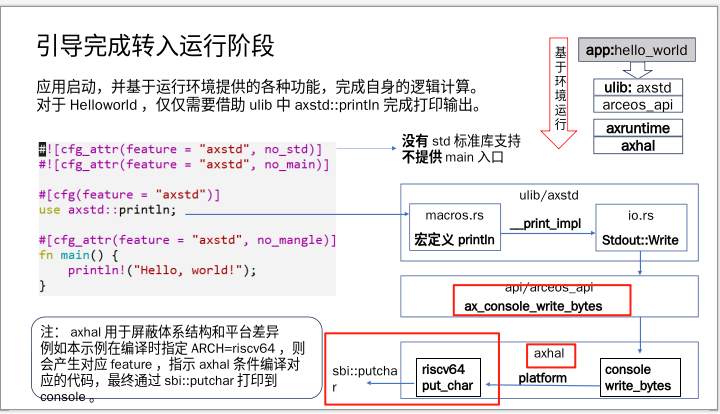

# 解题思路



1. 修改[sbi::putchar](../arceos/modules/axhal/src/platform/riscv64_qemu_virt/console.rs)的内容, 添加颜色信息. 

```rust
/// Writes a byte to the console.
pub fn putchar(c: u8) {
    #[allow(deprecated)]
    for b in b"\x1b[31m" {
        sbi_rt::legacy::console_putchar(*b as usize);
    }
    #[allow(deprecated)]
    sbi_rt::legacy::console_putchar(c as usize);
    #[allow(deprecated)]
    for b in b"\x1b[31m" {
        sbi_rt::legacy::console_putchar(*b as usize);
    }
}
```


2. 修改[sbi::putchar](../arceos/modules/axhal/src/platform/riscv64_qemu_virt/console.rs)的内容, 添加颜色信息. 